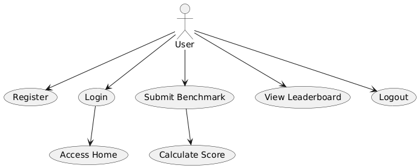
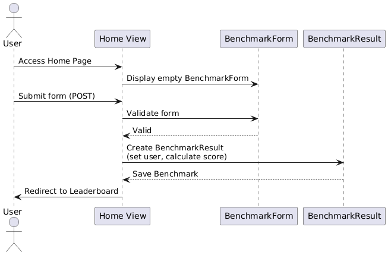

# 📊 BenchIt – Cahier des Charges

## 👥 Members
- **[Raed]** – [raedbgr]
- **[Fedy]** – [fedy47]
- **[Fares]** – [FaresBenAfia]
- **[Moetaz]** – [Moetaz]
<!-- Add more team members if applicable -->

---

## 🧾 Project Overview

- **Project Name:** BenchIt – Benchmark Web App  
- **Purpose:**  
  A web-based benchmarking platform where users can submit performance scores (CPU, GPU, RAM) and view a ranked leaderboard.
- **Scope:**  
  Full-stack web development using Django. Focused on backend functionality, user authentication.

---

## 🎯 Target Audience

- Tech enthusiasts who enjoy comparing performance scores.
- Employees benchmarking internal devices.

---

## 🛠 Technical Stack

| Layer       | Technology              |
|-------------|--------------------------|
| Frontend    | Django Templates, HTML, CSS (custom), Bootstrap |
| Backend     | Django (Python)          |
| Database    | Django                   |
| Versioning  | Git + GitHub             |

---

## 📚 Resources

- Django Documentation
- GitHub for collaboration

---

## ✅ Functional Requirements

| Page                 | Features |
|----------------------|----------|
| **Home Page**        | Welcome message, short app description, navigation to key pages |
| **Login/Register**   | Secure forms with validation and feedback |
| **Benchmark Form**   | Submit benchmark details (CPU, GPU, RAM, score) |
| **Leaderboard**      | View sorted list of all submitted benchmarks |
| **Logout**           | Secure logout via form button |

---

## 📈 Non-Functional Requirements

- **Performance:** Loads within 3 seconds on standard connection.
- **Compatibility:** Works on Chrome, Firefox, Safari, Edge.
- **Security:** CSRF protection, hashed passwords, input validation.

---

## 🧭 Pages and Features

### 🏠 Home Page
- App logo and title (`BenchIt`)
- Brief app description
- Navigation bar with links
- Call-to-action buttons

### 🧾 Benchmark Submission Page
- Form for CPU, GPU, RAM, and score
- Validated inputs
- Submission success message

### 🏆 Leaderboard Page
- Sorted table of scores (highest first)
- Display user and specs per entry
- Responsive grid/table layout

### 🔐 Register / Login Page
- Username, email, password fields
- Secure authentication flow
- Error messages and form feedback

### 🔗 Navbar
- Left: App name
- Right: Navigation links + Logout
- Sticky at top with styling

---

## 🗃 Database Schema

### `User`
- `id`: AutoField (PK)
- `username`: String
- `email`: String
- `password`: Hashed

### `Benchmark`
- `id`: AutoField (PK)
- `user`: ForeignKey to User
- `cpu`: CharField
- `gpu`: CharField
- `ram`: IntegerField (GB)
- `score`: IntegerField
- `date_created`: DateTimeField (auto_now_add=True)

---

## 🎨 Design & Layout

- **Theme:** Light UI with modern, smooth elements
- **Fonts:** Clean, legible fonts (e.g., Roboto)
- **Forms:** Centered, rounded corners, hover transitions
- **Navigation:** Uniform across all pages

---

## 🧠 User Interaction

- Hover effects on links and buttons
- Clickable navigation
- Form field feedback
- Leaderboard updates after submission

---

## 📊 UML Diagrams

### ✅ Use Case Diagram

### 🔁 Sequence Diagram

---

## 📦 Deliverables

- ✅ Functional Django web application
- ✅ Responsive layout with Bootstrap
- ✅ Pages: Home, Login/Register, Benchmark Form, Leaderboard
- ✅ Working user authentication
- ✅ GitHub repository with source code
- ✅ README with instructions

---
